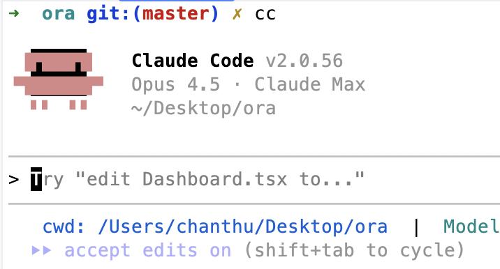

# LLM Driven Coding

Focussed on Claude Code (comment: I'm guessing a lot of these ideas will apply to other agents too)

## Claude Code Basics
- Claude.MD
- Sub agents: https://code.claude.com/docs/en/sub-agents
	- Specialised coding instances with custom rules
- Commands: https://code.claude.com/docs/en/slash-commands#slash-commands
	- Wrapper for commonly used prompts
- Skills: https://code.claude.com/docs/en/skills#agent-skills
	- Extend Claude with custom info that Claude uses when it thinks it's necessary
- Hooks: https://code.claude.com/docs/en/hooks-guide#get-started-with-claude-code-hooks
	- Callbacks


## My setup

#### Dangerous mode:
`alias cc="commitclaude --dangerously-skip-permissions”`

### Claude.MD
- Always have a root claude.md. 
- Talks about:
	- What the project is
    - Where all the other documentation files are
    	- File imports: 
          - ```
              @docs/backend.md - Backend development patterns and rules
              @docs/testing.md - Testing strategy and patterns
            ``` 
          - https://code.claude.com/docs/en/memory#claude-md-imports 
    - Tech stack
    - Explain each module/package and what they do (helps claude quickly identify where to put what)
    - General rules for the project. Examples of such rules:
      - Commenting rules
      - Typescript type safety rule (eg: No unjustified `any`)
      - Don’t use raw sql, use drizzle form syntax instead 
      - React hook rules. Use useMemo, useCallback etc 
      - But, any rule that can be enforced 100% will always be better than expecting AI to follow rules
        - ESLint rules are great for this. Why not get the LLM to write more ESLint rules?
      - 
- Can have Claude.MD in each of the packages/subfolders etc
- Periodically get *Claude* to double check and enhance the docs

### Sub agents


- Some of my agents: 
- No one size fits all. Customise to what you find is useful or what works for the project
- Can be at a project level or at a global level
- 2 major benefits:
	1. Sticks to rules better given specialised instructions
    2. Does not exhaust the main thread context given subagents have its own context
- Claude is meant to use agents automagically but always helps to say “Use agents"
- Explicit handover rules are good
- An agent example: 


### MCP
- Serena: https://github.com/oraios/serena
Uses language server protocol (LSP) to do semantic search and editing

- Playwright: https://github.com/microsoft/playwright-mcp
Provides browser automation capabilities

- Context7: https://github.com/upstash/context7
Exposes tools to search up to date documentation

### Plugins
- Superpowers: https://github.com/obra/superpowers
Provides a bunch of skills to Claude to use

```
/superpowers:brainstorm       Interactive design refinement using Socratic method (plugin:superpowers@superpowers-marketplace)

/superpowers:write-plan       Create detailed implementation plan with bite-sized tasks (plugin:superpowers@superpowers-marketplace)

/superpowers:execute-plan     Execute plan in batches with review checkpoints (plugin:superpowers@superpowers-marketplace)
```

- Superclaude: https://github.com/SuperClaude-Org/SuperClaude_Framework
Similar. I personally haven’t used.

## Context length problem
Limited context length especially when doing larger changes. Leading to lost instructions

### Solutions
- Use sub agents
- Get claude to write plans to file before execution so work can be resumed in worst case
    - superpowers does this when used
- Compact manually instead of automatic compaction at a bad time `/compact`
- Track context length in status line: https://github.com/sirmalloc/ccstatusline
 

## How to do a small feature vs big feature

### Small feature <!-- use this as umbrella header -->
- Get Claude to plan + execute all on its own.
- Don't be lazy with the prompts. Always give as much context as possible even for small features.
  - I sometimes start with "read and understand the code in <file a>, <folder b>"
  - Detailed description of the feature + Any ideas you have about implementation helps.
- Ask explicitly to:
  - Do web research or documentation search
  - Use playwright (or any other mcp) to open the app and test
  - Write even temporary end-to-end tests to verify (for example if an external api is called)
  - _In the end it's feedback loops that guide Claude_

### Big feature <!-- use this as umbrella header -->
- Start with built-in plan mode or /superpowers:brainstorm 
  -  Plan mode flow:  <!-- Show these on the same row -->
  - This breaks the problem down into smaller steps too
  - Write the plan to a file and ask to tick off as you go.
- Use agents to implement.
- Help Claude. If that means doing manual research, finding GitHub issues etc to feed Claude.

## Claude getting stuck or going in circles
- Break down the problem into smaller steps
- Git is your friend. Commit stable points, shelve changes and come back later etc
- Interrupt when you think it might be going down the wrong path. Just press escape. Tell it what it's doing wrong and then ask it to continue
- Use `/rewind` to rollback conversation to a stable point
- If one model is having issue, try another one. Use `/model`
- Can always ask Claude to summarise the conversation to a file and then start over

## Tips n tricks and caveats
- Write super basic initial code to give AI a base to work with if needed
  - Can even be super rough pseudo code to guide the design
- Give Claude screenshots to analyse
- Ask Claude to do a review/code cleanup/audit of the code once a feature is working
- Keep Claude.MD and friends up to date
  - Periodically
  - When a new pattern is identified
  - When you realise a particular pattern wasn't followed because it wasn't obvious

## How to apply all these to ailo repositories
- TODO

## Conclusion <!-- Don't include a thank you section -->
- AI most definitely won't be doing the right thing the first time you start using it.
- Gets better as you use it and learn the way it works
- You get better as your prompting skills, the way you work with it improves
- Gets better as your documentation, existing patterns, Claude.MD improves
- Of course, AI makes mistakes, hallucinates, goes down rabbit holes BUT
  - Agents/tooling has been improving fast so a problem it cannot solve now will most likely be a non-issue soon.
  - Help it when you can

