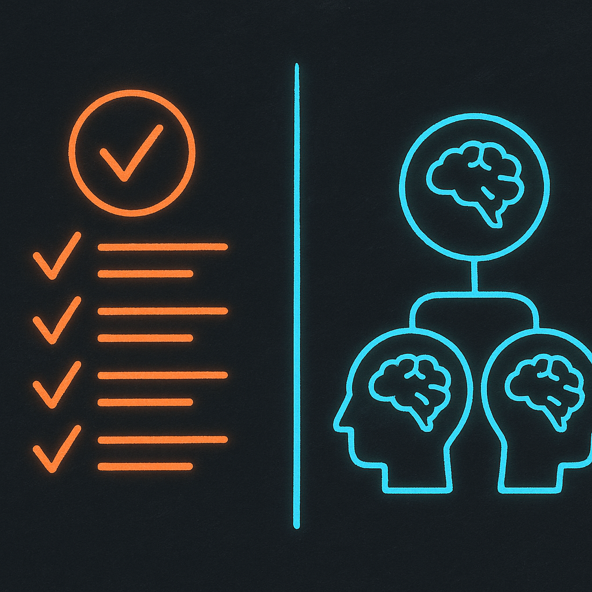

# LLM Driven Coding

## Focused on Claude Code


<!--
This presentation covers LLM-driven coding practices, focused on Claude Code.
I'm guessing a lot of these ideas will apply to other agents too.
-->

<!-- _transition: push -->

---

# Claude Code Basics


<!--
Overview of the core Claude Code features.
-->

---

## Claude.MD

- Project instructions file
- Claude reads on startup


<!--
Claude.MD is the main configuration file that Claude reads when starting a session.
-->

---

## Sub Agents

- Specialized coding instances
- Custom rules per agent

[Sub Agents Docs](https://code.claude.com/docs/en/sub-agents)


<!--
Sub agents are specialized instances with their own custom rules and context.
-->

---

## Commands

- Wrapper for common prompts
- Reusable shortcuts

[Commands Docs](https://code.claude.com/docs/en/slash-commands#slash-commands)

<!--
Commands let you create shortcuts for commonly used prompts.
-->

---

## Skills

- Extend Claude capabilities
- Used when Claude thinks necessary

[Skills Docs](https://code.claude.com/docs/en/skills#agent-skills)

<!--
Skills extend Claude with custom information that Claude uses when it thinks it's necessary.
-->

---

## Hooks

- Callbacks on events

[Hooks Docs](https://code.claude.com/docs/en/hooks-guide#get-started-with-claude-code-hooks)

<!--
Hooks are callbacks that trigger on specific events during Claude's operation.
-->

<!-- _transition: push -->

---

# My Setup


<!--
Here's how I configure my Claude Code environment.
-->

---

## Dangerous Mode

```bash
alias cc="claude --dangerously-skip-permissions"
```


<!--
This alias skips permission prompts for faster iteration.
Use with caution - only in trusted projects.
-->

---

## Claude.MD: Root File

- Always have root claude.md
- Describes what project is
- Links to other doc files


<!--
The root claude.md should be the entry point that describes the project and links to other documentation.
See: https://code.claude.com/docs/en/memory#claude-md-imports
-->

---

## Claude.MD Imports

```markdown
@docs/backend.md - Backend patterns
@docs/testing.md - Testing strategy
```

<!--
You can import other markdown files to keep documentation modular.
-->

---

## Claude.MD Contents

- Tech stack details
- Module/package explanations
- Helps Claude find code fast

<!--
Explain each module and package so Claude can quickly identify where to put what.
-->

---

## Project Rules

- Commenting rules
- No unjustified `any`
- Use Drizzle, not raw SQL
- React hooks best practices


<!--
Include rules like:
- TypeScript type safety (no unjustified any)
- Use Drizzle ORM syntax instead of raw SQL
- Proper useMemo, useCallback usage
-->

---

## Enforce Rules with ESLint

- Rules AI can't break = best
- Let LLM write ESLint rules
- 100% enforcement > AI compliance

<!--
Any rule that can be enforced 100% will always be better than expecting AI to follow rules.
ESLint rules are great for this. Why not have the LLM write more ESLint rules?
-->

---

## Nested Claude.MD Files

- Can have per-package files
- Claude enhances docs periodically

<!--
You can have claude.md in each package/subfolder.
Periodically get Claude to double-check and enhance the docs.
-->

<!-- _transition: push -->

---

# Sub Agents


<!--
Deep dive into sub agents configuration.
-->

---

## My Sub Agents

- code-review-engineer
- full-stack-architect
- qa-test-engineer
- frontend-engineer
- backend-engineer

<!--
Example agent list from /agents command showing project-level agents.
Also plugin agents like superpowers:code-reviewer.
-->

---

## Sub Agent Tips

- No one-size-fits-all
- Project or global level
- Say "Use agents" explicitly
- Add explicit handover rules

<!--
Customize to what works for your project.
Claude is meant to use agents automatically but it helps to be explicit.
-->

---

## Sub Agent Benefits

1. Follows rules better
2. Own context (saves main)



<!--
Sub agents stick to rules better with specialized instructions.
They don't exhaust main thread context since they have their own.
-->

<!-- _transition: push -->

---

# MCP


<!--
Model Context Protocol plugins extend Claude's capabilities.
-->

---

## Serena

- Uses Language Server Protocol
- Semantic search and editing

[github.com/oraios/serena](https://github.com/oraios/serena)


<!--
Serena uses LSP to do semantic search and editing of code.
-->

---

## Playwright

- Browser automation capabilities

[github.com/microsoft/playwright-mcp](https://github.com/microsoft/playwright-mcp)

<!--
Playwright MCP provides browser automation capabilities.
-->

---

## Context7

- Search up-to-date documentation

[github.com/upstash/context7](https://github.com/upstash/context7)

<!--
Context7 exposes tools to search up-to-date documentation.
-->

<!-- _transition: push -->

---

# Plugins


<!--
Additional plugins that enhance Claude Code.
-->

---

## Superpowers Plugin

[github.com/obra/superpowers](https://github.com/obra/superpowers)

- Provides skills for Claude


<!--
Superpowers provides a bunch of skills to Claude to use.
-->

---

## Superpowers Commands

- `/superpowers:brainstorm`
- `/superpowers:write-plan`
- `/superpowers:execute-plan`

<!--
brainstorm: Interactive design refinement using Socratic method
write-plan: Create detailed implementation plan with bite-sized tasks
execute-plan: Execute plan in batches with review checkpoints
-->

---

## Superclaude

[github.com/SuperClaude-Org/SuperClaude_Framework](https://github.com/SuperClaude-Org/SuperClaude_Framework)

- Similar to Superpowers
- Haven't personally used

<!--
Similar to Superpowers. I personally haven't used it.
-->

<!-- _transition: push -->

---

# Context Length Problem


<!--
Managing context length is crucial for long sessions.
-->

---

## Context Solutions

- Use sub agents
- Manual `/compact` early
- Write plans to file
- Superpowers does this


<!--
Use sub agents to offload context.
Compact manually instead of waiting for automatic compaction at a bad time.
Get Claude to write plans to file before execution so work can be resumed.
-->

---

## Track Context Length

[github.com/sirmalloc/ccstatusline](https://github.com/sirmalloc/ccstatusline)

```
Model: Opus 4.5 | Ctx: 126.4k | Ctx(u): 79.0%
```

<!--
Use ccstatusline to track context usage in your status line.
Shows cwd, model, context size, and percentage used.
-->

---

# How to do a small feature

## Coming Soon


<!--
TODO section - content to be added.
-->

---

# How to do a bigger feature

## Coming Soon


<!--
TODO section - content to be added.
-->

---

# Claude getting stuck

## Coming Soon


<!--
TODO section - strategies for when Claude goes in circles.
-->

---

# Dealing with caveats

## Coming Soon


<!--
TODO section - content to be added.
-->

---

# Applying to Ailo repositories

## Coming Soon


<!--
TODO section - specific guidance for Ailo repos.
-->

<!-- _transition: fade-out -->

---

# Thank You

## Questions?


<!--
Thank you for attending. Questions welcome!
-->
