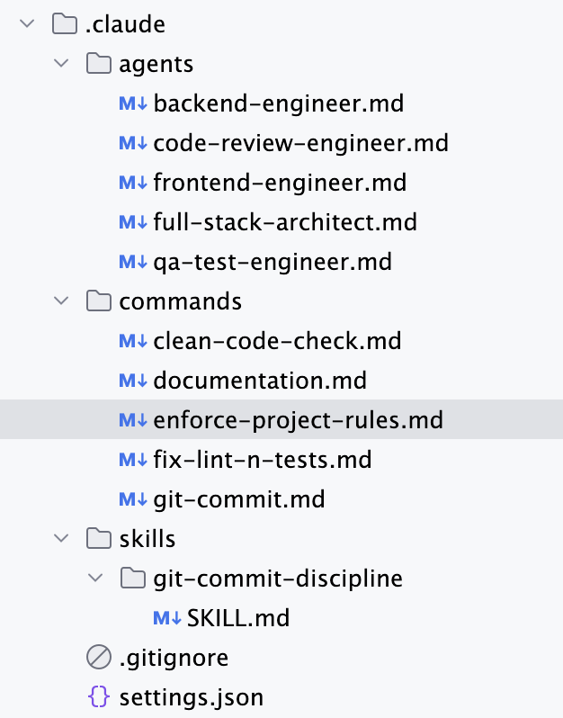
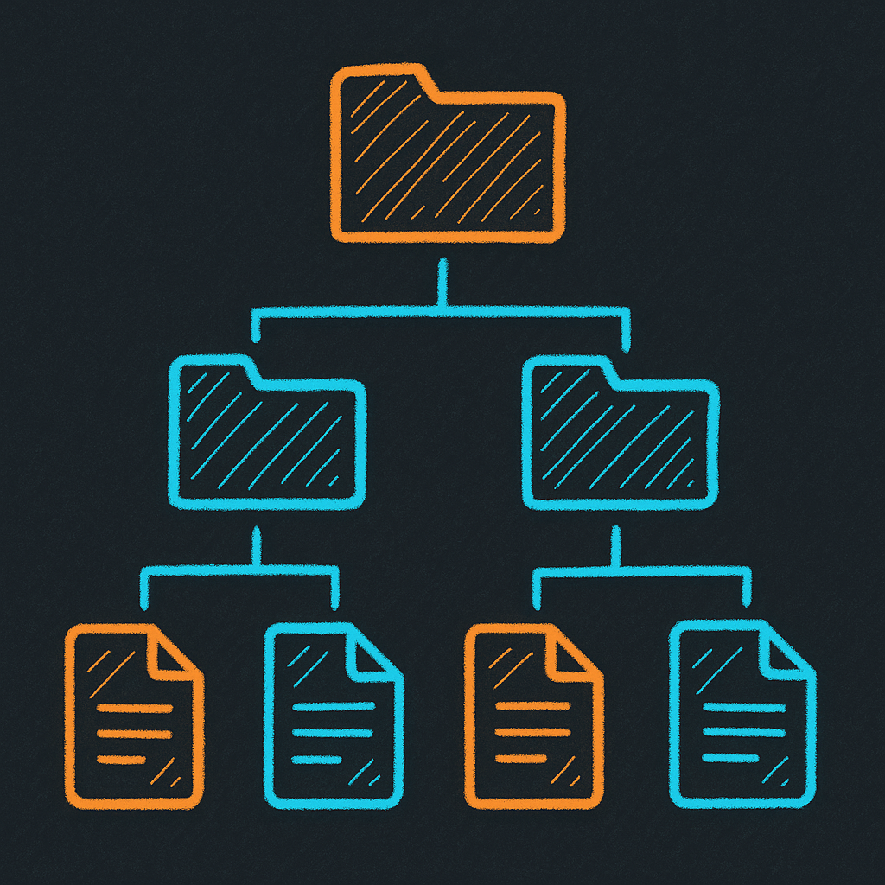
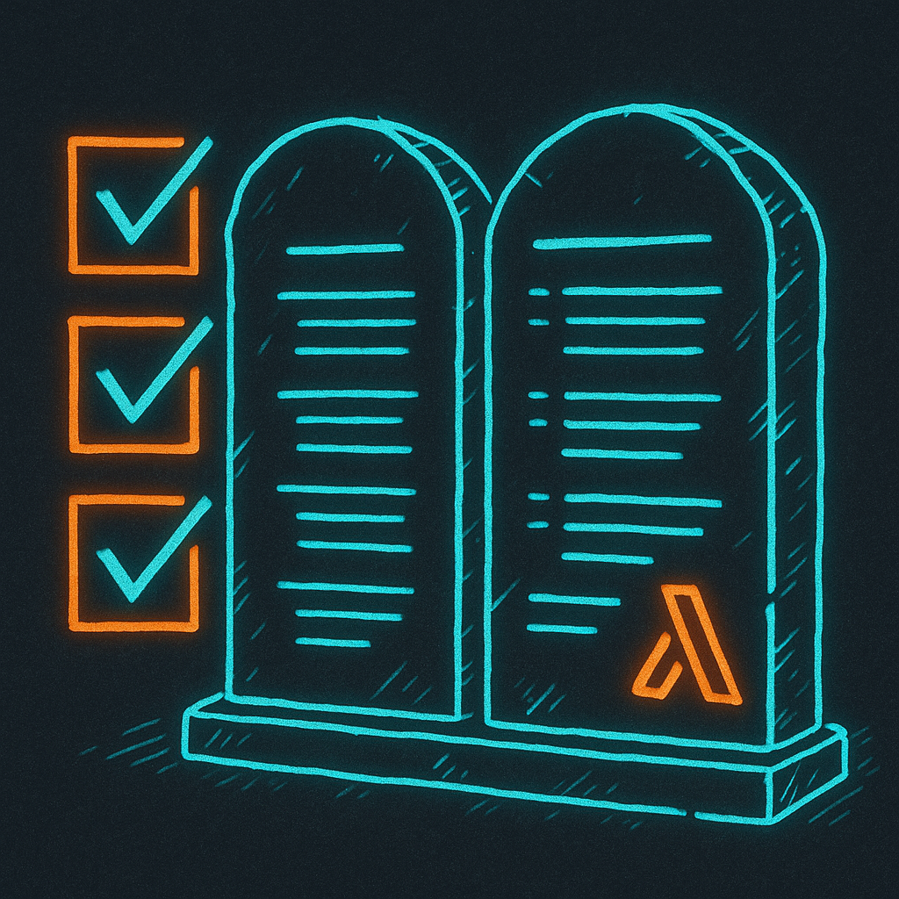
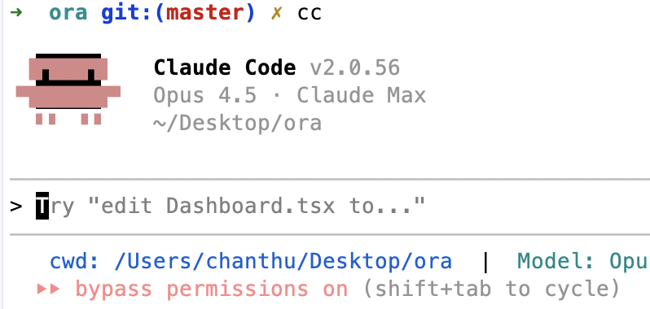

# LLM Driven Coding

## Focused on Claude Code


<!--
Speaker note: These ideas will likely apply to other AI coding agents too.
-->

<!-- _transition: push -->

---

<!-- SECTION: Claude Code Basics -->

<h1 style="view-transition-name: section-basics;">Claude Code Basics</h1>

- **Claude.MD** - Project configuration
- **Sub agents** - Specialised coding instances with custom rules
- **Commands** - Wrapper for commonly used prompts
- **Skills** - Extend Claude with custom info it uses when necessary
- **Hooks** - Callbacks



---

<h3 style="view-transition-name: section-basics;" class="section-breadcrumb">Claude Code Basics</h3>

## Documentation Links

- [Sub agents](https://code.claude.com/docs/en/sub-agents)
- [Commands](https://code.claude.com/docs/en/slash-commands#slash-commands)
- [Skills](https://code.claude.com/docs/en/skills#agent-skills)
- [Hooks](https://code.claude.com/docs/en/hooks-guide#get-started-with-claude-code-hooks)


<!-- _transition: push -->

---

<!-- SECTION: My Setup -->

<h1 style="view-transition-name: section-setup;">My Setup</h1>

## Dangerous Mode

```bash
alias cc="claude --dangerously-skip-permissions"
```


---

<!-- SUBSECTION: Claude.MD -->

<h3 style="view-transition-name: section-setup;" class="section-breadcrumb">My Setup</h3>

# Claude.MD

## Always have a root claude.md


---

<h3 style="view-transition-name: section-setup;" class="section-breadcrumb">My Setup › Claude.MD</h3>

## What it talks about

- What the project is
- Where all the other documentation files are
- Tech stack
- Explain each module/package and what they do



---

<h3 style="view-transition-name: section-setup;" class="section-breadcrumb">My Setup › Claude.MD</h3>

## File Imports

```markdown
@docs/backend.md - Backend development patterns and rules
@docs/testing.md - Testing strategy and patterns
```

[File imports documentation](https://code.claude.com/docs/en/memory#claude-md-imports)


---

<h3 style="view-transition-name: section-setup;" class="section-breadcrumb">My Setup › Claude.MD</h3>

## General Rules

- Commenting rules
- Typescript type safety rule (eg: No unjustified `any`)



---

<h3 style="view-transition-name: section-setup;" class="section-breadcrumb">My Setup › Claude.MD</h3>

## Example: Use Drizzle ORM

Don't use raw sql, use drizzle form syntax instead


---

<h3 style="view-transition-name: section-setup;" class="section-breadcrumb">My Setup › Claude.MD</h3>

## Example: React Hooks

Use useMemo, useCallback etc


---

<h3 style="view-transition-name: section-setup;" class="section-breadcrumb">My Setup › Claude.MD</h3>

## Enforcement Strategy

- Any rule that can be enforced 100% is better than expecting AI to follow rules
- ESLint rules are great for this
- Why not get the LLM to write more ESLint rules?


---

<h3 style="view-transition-name: section-setup;" class="section-breadcrumb">My Setup › Claude.MD</h3>

## Structure

- Can have claude.md in each of the packages/subfolders etc
- Periodically get *Claude* to double check and enhance the docs


<!-- _transition: push -->

---

<!-- SECTION: Sub Agents -->

<h1 style="view-transition-name: section-agents;">Sub Agents</h1>


---

<h3 style="view-transition-name: section-agents;" class="section-breadcrumb">Sub Agents</h3>

## Some of my agents


---

<h3 style="view-transition-name: section-agents;" class="section-breadcrumb">Sub Agents</h3>

## Configuration Tips

- No one size fits all - customise to what works for the project
- Can be at a project level or at a global level


---

<h3 style="view-transition-name: section-agents;" class="section-breadcrumb">Sub Agents</h3>

## Two Major Benefits

1. Sticks to rules better given specialised instructions
2. Does not exhaust the main thread context - subagents have their own context


---

<h3 style="view-transition-name: section-agents;" class="section-breadcrumb">Sub Agents</h3>

## Usage Tips

- Claude is meant to use agents automagically but always helps to say "Use agents"
- Explicit handover rules are good


---

<h3 style="view-transition-name: section-agents;" class="section-breadcrumb">Sub Agents</h3>

## An agent example


<!-- _transition: push -->

---

<!-- SECTION: MCP -->

<h1 style="view-transition-name: section-mcp;">MCP</h1>

## Model Context Protocol


---

<h3 style="view-transition-name: section-mcp;" class="section-breadcrumb">MCP</h3>

# Serena

Uses Language Server Protocol (LSP) to do semantic search and editing

[github.com/oraios/serena](https://github.com/oraios/serena)


---

<h3 style="view-transition-name: section-mcp;" class="section-breadcrumb">MCP</h3>

# Playwright

Provides browser automation capabilities

[github.com/microsoft/playwright-mcp](https://github.com/microsoft/playwright-mcp)


---

<h3 style="view-transition-name: section-mcp;" class="section-breadcrumb">MCP</h3>

# Context7

Exposes tools to search up to date documentation

[github.com/upstash/context7](https://github.com/upstash/context7)


<!-- _transition: push -->

---

<!-- SECTION: Plugins -->

<h1 style="view-transition-name: section-plugins;">Plugins</h1>

## Superpowers

Provides a bunch of skills to Claude to use

[github.com/obra/superpowers](https://github.com/obra/superpowers)


---

<h3 style="view-transition-name: section-plugins;" class="section-breadcrumb">Plugins</h3>

## Superpowers Commands

```
/superpowers:brainstorm
  Interactive design refinement using Socratic method

/superpowers:write-plan
  Create detailed implementation plan with bite-sized tasks

/superpowers:execute-plan
  Execute plan in batches with review checkpoints
```


---

<h3 style="view-transition-name: section-plugins;" class="section-breadcrumb">Plugins</h3>

## SuperClaude Framework

Similar capabilities. I personally haven't used.

[github.com/SuperClaude-Org/SuperClaude_Framework](https://github.com/SuperClaude-Org/SuperClaude_Framework)


<!-- _transition: push -->

---

<!-- SECTION: Context Length -->

<h1 style="view-transition-name: section-context;">Context Length Problem</h1>

Limited context length especially when doing larger changes. Leading to lost instructions.


---

<h3 style="view-transition-name: section-context;" class="section-breadcrumb">Context Length</h3>

## Managing Context

- Use sub agents
- Compact manually instead of automatic compaction at a bad time: `/compact`
- Get Claude to write plans to file before execution so work can be resumed
  - Superpowers does this when used


---

<h3 style="view-transition-name: section-context;" class="section-breadcrumb">Context Length</h3>

## Status Line

Track context length in status line


[github.com/sirmalloc/ccstatusline](https://github.com/sirmalloc/ccstatusline)

<!-- _transition: push -->

---

<!-- SECTION: Small Feature (umbrella) -->

<h1 style="view-transition-name: section-small;">Small Feature</h1>


---

<h3 style="view-transition-name: section-small;" class="section-breadcrumb">Small Feature</h3>

## Let Claude Handle It

- Get Claude to plan + execute all on its own
- Don't be lazy with prompts - give as much context as possible


---

<h3 style="view-transition-name: section-small;" class="section-breadcrumb">Small Feature</h3>

## Context Tips

- Start with "read and understand the code in &lt;file a&gt;, &lt;folder b&gt;"
- Detailed description of the feature + implementation ideas


---

<h3 style="view-transition-name: section-small;" class="section-breadcrumb">Small Feature</h3>

## Ask Claude Explicitly To:

- Do web research or documentation search
- Use Playwright (or any MCP) to open the app and test
- Write temporary end-to-end tests to verify
- _In the end it's feedback loops that guide Claude_


<!-- _transition: push -->

---

<!-- SECTION: Big Feature (umbrella) -->

<h1 style="view-transition-name: section-big;">Big Feature</h1>


---

<h3 style="view-transition-name: section-big;" class="section-breadcrumb">Big Feature</h3>

## Strategy

- Start with built-in plan mode or `/superpowers:brainstorm`
- Use agents to implement
- Help Claude - do manual research, find GitHub issues to feed it


---

<h3 style="view-transition-name: section-big;" class="section-breadcrumb">Big Feature</h3>

## Plan Mode (Shift+Tab)

<table>
<tr>
<td>



</td>
<td>


</td>
<td>


</td>
</tr>
</table>

<!-- _transition: push -->

---

<!-- SECTION: Getting Unstuck -->

<h1 style="view-transition-name: section-stuck;">Claude Getting Stuck</h1>

## or Going in Circles


---

<h3 style="view-transition-name: section-stuck;" class="section-breadcrumb">Getting Unstuck</h3>

## Use Git

- Git is your friend
- Commit stable points
- Shelve changes and come back later


---

<h3 style="view-transition-name: section-stuck;" class="section-breadcrumb">Getting Unstuck</h3>

## Interrupt and Redirect

- Press escape when it's going wrong
- Tell it what it's doing wrong
- Then ask it to continue


---

<h3 style="view-transition-name: section-stuck;" class="section-breadcrumb">Getting Unstuck</h3>

## Other Tools

- Use `/rewind` to rollback conversation to a stable point
- If one model is having issues, try another with `/model`


<!-- _transition: push -->

---

<!-- SECTION: Tips n Tricks -->

<h1 style="view-transition-name: section-tips;">Tips n Tricks</h1>


---

<h3 style="view-transition-name: section-tips;" class="section-breadcrumb">Tips n Tricks</h3>

## Give AI a Starting Point

- Write super basic initial code to give AI a base to work with
- Can even be super rough pseudo code to guide the design


<!-- _transition: push -->

---

<!-- SECTION: Coming Soon -->

<h1 style="view-transition-name: section-soon;">Coming Soon</h1>


---

<h3 style="view-transition-name: section-soon;" class="section-breadcrumb">Coming Soon</h3>

## How to Apply to Ailo Repositories


<!-- _transition: push -->

---

<!-- SECTION: Conclusion -->

<h1 style="view-transition-name: section-conclusion;">Conclusion</h1>


---

<h3 style="view-transition-name: section-conclusion;" class="section-breadcrumb">Conclusion</h3>

## AI Won't Be Right the First Time

- Gets better as you use it and learn the way it works
- You get better as your prompting skills improve
- Gets better as documentation, patterns, Claude.MD improves


---

<h3 style="view-transition-name: section-conclusion;" class="section-breadcrumb">Conclusion</h3>

## Yes, AI Makes Mistakes

- Agents/tooling has been improving fast
- A problem it cannot solve now will likely be a non-issue soon
- Help it when you can


