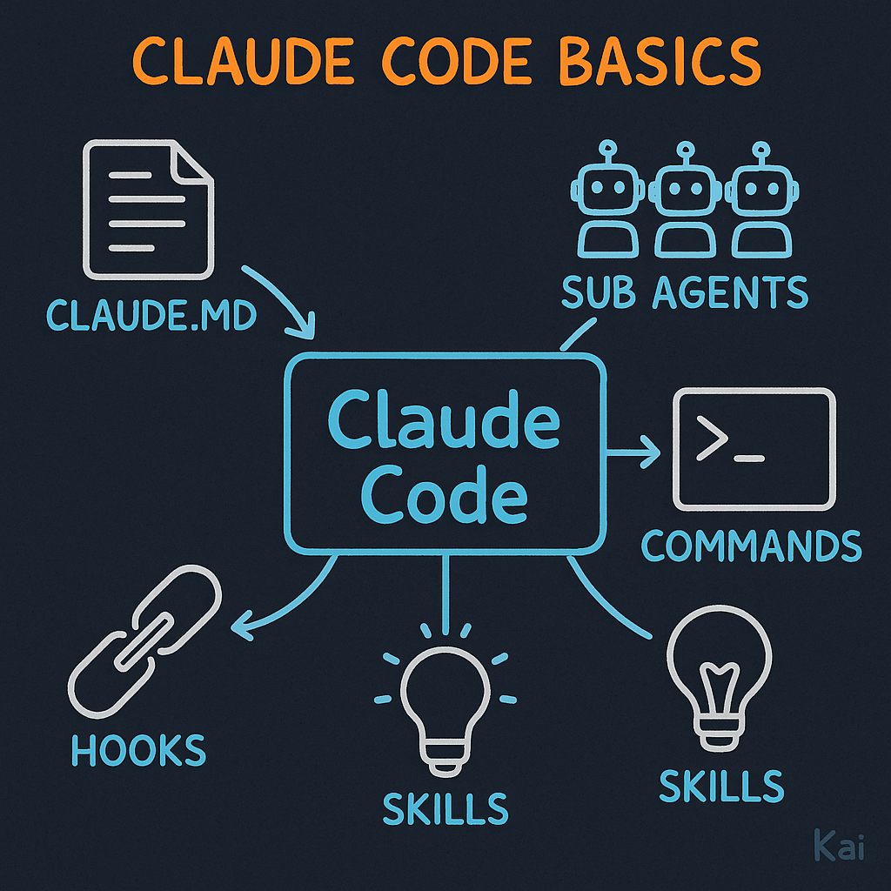

# LLM Driven Coding

Focused on **Claude Code**

*(Most ideas apply to other agents too)*

<!--
This presentation covers how to effectively use Claude Code for development.
While focused on Claude Code specifically, many concepts transfer to other AI coding agents.
-->

---

# Claude Code Basics



- **CLAUDE.MD** - Project context file
- **Sub agents** - Specialized instances
- **Commands** - Reusable prompt wrappers
- **Skills** - Custom info extensions
- **Hooks** - Event callbacks

<!--
These are the five core building blocks of Claude Code.
Links:
- Sub agents: https://code.claude.com/docs/en/sub-agents
- Commands: https://code.claude.com/docs/en/slash-commands
- Skills: https://code.claude.com/docs/en/skills
- Hooks: https://code.claude.com/docs/en/hooks-guide
-->

---

# My Setup

## Dangerous Mode

```bash
alias cc="claude --dangerously-skip-permissions"
```

<!--
This alias skips permission prompts for faster iteration.
Use with caution - only in trusted environments.
-->

---

# Claude.MD

## What to include in root claude.md:

- What the project is
- Where documentation files are
- Tech stack
- Module/package explanations
- General project rules

<!--
Always have a root CLAUDE.MD file.
This is the primary way to give Claude context about your project.
-->

---

# Claude.MD - Imports

## Importing other documentation:

```markdown
@docs/backend.md - Backend patterns and rules
@docs/testing.md - Testing strategy and patterns
```

See: [claude-md-imports](https://code.claude.com/docs/en/memory#claude-md-imports)

<!--
You can import other markdown files to keep documentation modular.
This helps organize large projects.
-->

---

# Claude.MD - Rules Examples

- Commenting rules
- No unjustified `any` in TypeScript
- Use Drizzle ORM, not raw SQL
- React hooks: useMemo, useCallback

<!--
Be specific about coding standards.
These rules help Claude generate consistent code.
-->

---

# Claude.MD - Tips

- Can have claude.md in subfolders
- Periodically get Claude to enhance docs

<!--
Subfolder CLAUDE.MD files provide context specific to that module.
Let Claude help maintain its own documentation.
-->

---

# Sub Agents

```
> /agents
├── code-review-engineer · opus
├── full-stack-architect · opus
├── qa-test-engineer · opus
├── frontend-engineer · opus
├── backend-engineer · opus
└── superpowers:code-reviewer · sonnet
```

<!--
This shows the /agents command output.
Agents can be at project level or global level.
-->

---

# Sub Agents - Benefits

- No one size fits all - customize!
- Project level or global level
- **Benefit 1:** Sticks to rules better
- **Benefit 2:** Own context (saves main)
- Say "Use agents" to trigger them

<!--
The context benefit is huge - complex tasks don't exhaust your main conversation.
Explicit handover rules are good to define.
Claude uses agents automatically but explicit prompting helps.
-->

---

# MCP


- **Serena** - LSP semantic search
  [github.com/oraios/serena](https://github.com/oraios/serena)
- **Playwright** - Browser automation
  [github.com/microsoft/playwright-mcp](https://github.com/microsoft/playwright-mcp)
- **Context7** - Up-to-date docs
  [github.com/upstash/context7](https://github.com/upstash/context7)

<!--
MCP = Model Context Protocol servers.
These extend Claude's capabilities with specialized tools.
-->

---

# Plugins

## Superpowers
[github.com/obra/superpowers](https://github.com/obra/superpowers)

```
/superpowers:brainstorm   - Socratic design
/superpowers:write-plan   - Detailed planning
/superpowers:execute-plan - Batch execution
```

## Superclaude
[github.com/SuperClaude-Org/SuperClaude_Framework](https://github.com/SuperClaude-Org/SuperClaude_Framework)
*(Similar, personally haven't used)*

<!--
Superpowers provides structured workflows for brainstorming, planning, and execution.
-->

---

# Context Length Problem


- Use sub agents
- Manual compact: `/compact`
- Write plans to file first
  - Superpowers does this
- Track context in status line

<!--
Context exhaustion is the #1 challenge with AI coding.
The status line tool: https://github.com/sirmalloc/ccstatusline
Example: cwd: ~/project | Model: Opus 4.5 | Ctx: 126.4k | Ctx(u): 79.0%
-->

---

# How to do a small feature

## Coming Soon

<!--
TODO section from source file.
-->

---

# How to do a bigger feature

## Coming Soon

<!--
TODO section from source file.
-->

---

# Claude getting stuck or going in circles

## Coming Soon

<!--
TODO section from source file.
-->

---

# Dealing with caveats

## Coming Soon

<!--
TODO section from source file.
-->

---

# How to apply to ailo repositories

## Coming Soon

<!--
TODO section from source file.
-->
